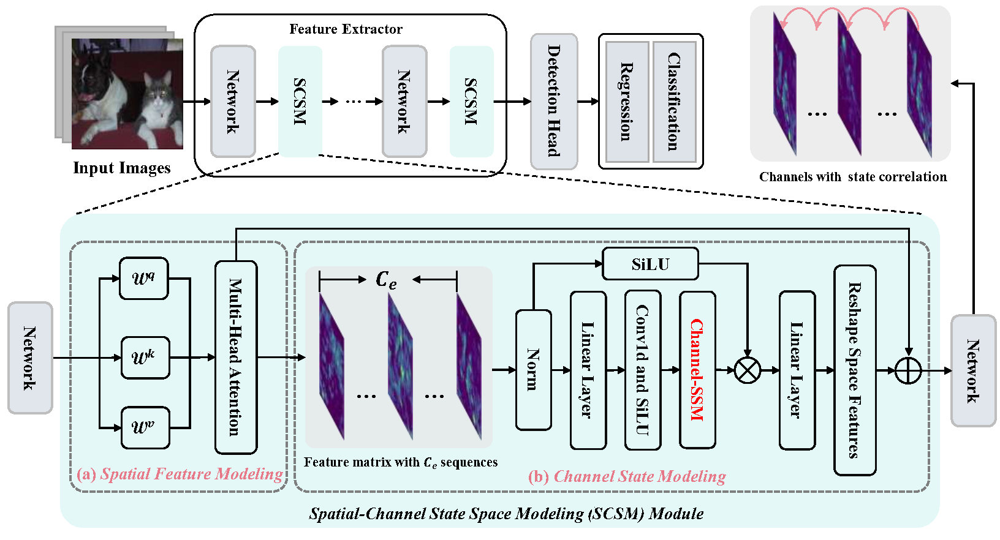

## Few-Shot Object Detection via Spatial-Channel State Space Model


<div align="center"></div>


## Quick Start

**1. Check Requirements**
* Linux with Python >= 3.10
* [PyTorch](https://pytorch.org/get-started/locally/) >= 2.1.1 & [torchvision](https://github.com/pytorch/vision/) that matches the PyTorch version.
* CUDA 11.7 11.8


**2. Build SCSM**

* Install PyTorch 2.1.1 with CUDA 11.8 
  ```shell
  conda install pytorch==2.1.1 torchvision==0.16.1 torchaudio==2.1.1 pytorch-cuda=11.8 -c pytorch -c nvidia
  ```
* Install Detectron2==0.6
 
  - If you use other version of PyTorch/CUDA, check the latest version of Detectron2 in this page: [Detectron2](https://github.com/facebookresearch/detectron2/releases). 
 
* Install other requirements. 
  ```angular2html
  pip install -r requirements.txt
  ```

**3. Prepare Data**
* Data Preparation
 
  - Unzip the downloaded data-source to `datasets` and put it into your project directory:
    ```angular2html
      ...
      datasets
        | -- coco (trainval2014/*.jpg, val2014/*.jpg, annotations/*.json)
        | -- cocosplit
        | -- VOC2007
        | -- VOC2012
        | -- vocsplit
      scsm
      tools
      ...
    ```

**4. Training and Evaluation**

* Fist run voc base.
  ```angular2html
  bash run_voc_base.sh
  ```

* pre-trained base model prepare.
  ```angular2html
   python tools/model_surgery.py --dataset voc --method randinit                         \
     --src-path ${SAVE_DIR}/voc_base/model_final.pth                      \
     --save-dir ${SAVE_DIR}/voc_base
  ```


* Then run voc novel.
  ```angular2html
  bash run_voc_base.sh
  ```


* Fist run coco base.
  ```angular2html
  bash run_coco_base.sh
  ```

* pre-trained base model prepare.
  ```angular2html
   python tools/model_surgery.py --dataset voc --method remove                         \
     --src-path ${SAVE_DIR}/coco_base/model_final.pth                      \
     --save-dir ${SAVE_DIR}/coco_base
  ```


* Then run coco novel.
  ```angular2html
  bash run_coco_base.sh
  ```
  


## Citing

